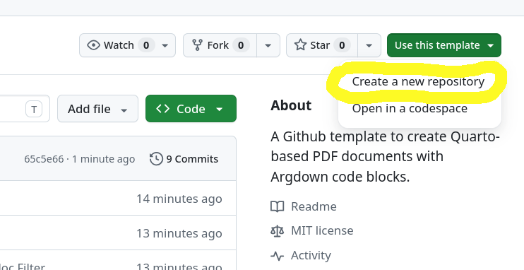
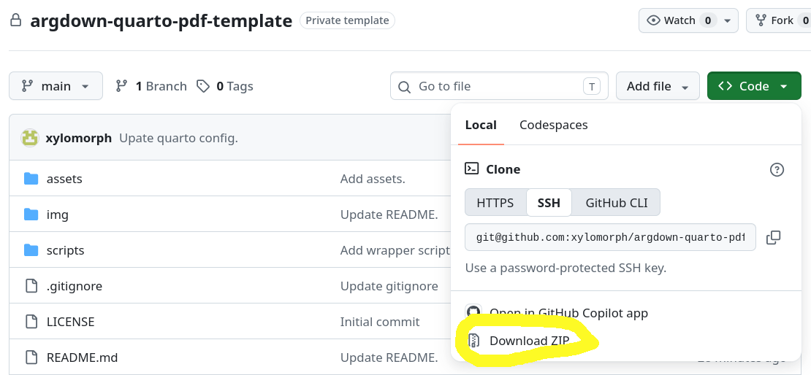
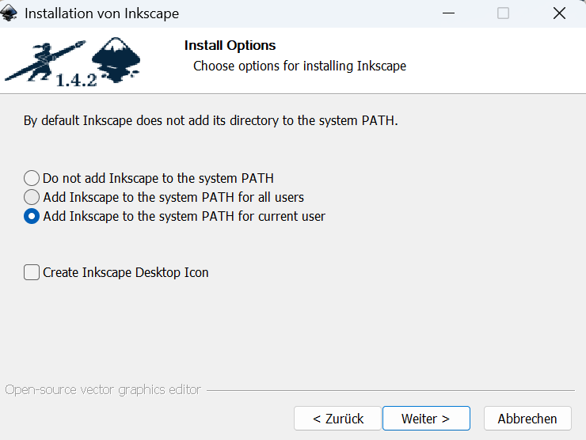

# Argdown-Quarto-Pdf Template

<div align="center">
  <p align="center">
  📝 <a href="https://github.com/xylomorph/argdown-quarto-pdf-template/blob/main/example-doc.qmd">Example Quarto File</a>
  📄 <a href="https://github.com/xylomorph/argdown-quarto-pdf-template/blob/main/example-doc.pdf">Generated Example PDF Output</a>
  🗒️ <a href="https://sebastiancacean.de/quarto-course-template">Background & Motivation (Blog Post)</a>
 </p>
</div>
<br/>

A GitHub template to create Quarto-based PDF documents with [Argdown](https://argdown.org/) source blocks. (to revise)

## Features

- **Handouts & notes** — PDF output with custom header/footer via LaTeX partials
- **Argdown integration** — argument maps and highlighted source blocks in PDF outputs (inline SVG)
- **Argdown syntax highlighting** in PDF via a custom `.xml` syntax definition and `.theme` file
- **Custom annotation CSS** — `.ann-premise`, `.ann-conclusion`, `.ann-key`, `.ann-doubt`, `.ann-marginal` span classes for slide markup


## Getting Started

This document will guide you through using this GitHub template.

### 1. Download the Template

Click **"Use this template"** on GitHub to create a new repository, then clone it locally.



Alternatively, simply download the template and unpack the ZIP file locally.



### 2. Install Software Dependencies

This template uses different tools to build PDFs based on Quarto Markdown files:

| Tool | Purpose | Install |
|------|---------|---------|
| [Quarto](https://quarto.org) ≥ 1.5 | Rendering | [quarto.org/docs/get-started](https://quarto.org/docs/get-started/) |
| Node | Installation of Argdown packages | e.g., `nvm install node` |
| `@argdown/pandoc-filter` | Argdown rendering | `npm install` (see below) |
| [Inkscape](https://inkscape.org) | SVG→PDF conversion for argdown maps in PDF | system package |

#### Install Quarto & Latex

Follow the instructions on [quarto.org/docs/get-started](https://quarto.org/docs/get-started/) to install Quarto for your operating system.

Quarto uses [Pandoc](https://pandoc.org/) to generate PDF files, which uses LaTeX in its toolchain. Accordingly, you need a TeX distribution installed. Quarto supports a wide range of TeX distributions (for details see [here](https://quarto.org/docs/output-formats/pdf-engine.html)). 

If you do not have a TeX distribution already installed, you should use [TinyTex](https://yihui.org/tinytex/) together with Quarto’s built-in PDF compilation engine. To install TinyTex within Quarto, use 

```bash
quarto install tinytex
```

in your terminal (e.g. bash on Linux or PowerShell on Windows). (If these things do not mean anything to you, use Google or your AI assistant as a starting point.)

> [!NOTE]
With TinyTex, Quarto can install the necessary LaTeX dependencies on its own.

> [!TIP]
> From time to time you might need to update TinyTex by yourself with
> ```bash
> quarto update tinytex
> ```

Further details about Quarto's PDF rendering process and options can be found under <https://quarto.org/docs/output-formats/pdf-basics.html>.

<!--
-> These should be installed automatically with TinyTex, right?
Also install the LaTeX `svg` and `mdframed` packages if not included with your TeX distribution.
-->

#### Install Node and the Argdown Pandoc-Filter

Quarto relies on the [Argdown Pandoc-Filter](https://github.com/argdown/argdown/blob/main/packages/argdown-pandoc-filter/README.md) to process Argdown source blocks. To install the Argdown Pandoc-Filter, you need to install `node.js` first. 

There are several ways to install `node.js` on your operating system. One popular way is to use the node manager [`nvm`](https://github.com/nvm-sh/nvm), which can manage multiple Node versions on your system. `nvm` is available for different operating systems. Some useful starting points:

+ **On Windows:** ["Install Node.js on Windows" on *learn.microsoft.com*](https://learn.microsoft.com/en-us/windows/dev-environment/javascript/nodejs-on-windows)
+ **On Linux & maxOS:** [https://github.com/nvm-sh/nvm](https://github.com/nvm-sh/nvm) 

With `nvm`, you can install a specific Node version (here `lts/krypton` as an example) with

```bash
nvm install lts/krypton
```

and then activate this version with

```bash
nvm use lts/krypton
```

This works with both the Windows and the Linux/macOS version of `nvm`.

Once `node.js` is installed (and active), you can install all needed Argdown packages. I recommend installing them locally as project dependencies (for alternatives and some background information, see [below](#1-quarto-filter-options-for-argdown-filter)):

Switch to your terminal and navigate to the directory containing the downloaded template. Note that on Windows, directory patterns use `\` and on Linux and macOS `/`.

```bash
cd directory/of/template
```

Install Argdown and related tools locally (will be installed under `./node_modules`):

```bash
npm install
```

This installs the dependencies defined in `package.json` into `./node_modules`, including:

- `@argdown/cli` — Argdown processor
- `@argdown/pandoc-filter` — Pandoc filter for Argdown rendering
- `@argdown/image-export` — Argdown diagram export

> [!NOTE]
> **Using globally installed Argdown**
>
> You can also install all node dependencies globally by using the `-g` flag with `npm install -g <pkg_name>`. However, currently the Quarto files are configured to use a locally installed filter. The path
> is specified in the respective YAML file headers. Additionally, Quarto might have trouble detecting a globally installed Argdown Pandoc-Filter. Hence, you might have to specify its full path or use a wrapper script (see [below](#1-quarto-filter-options-for-argdown-filter) for more details).

#### Specifying the Location of the Argdown Pandoc-Filter

Quarto needs to know where to find the installed Argdown Pandoc-Filter, which is specified in `_quarto.yml`

On Linux and macOS, the corresponding path for the locally installed Argdown Pandoc-Filter is specified via:

```yaml
filters:
  - node_modules/.bin/argdown-filter
``` 

On Windows, it needs to be set to:

```yaml
filters:
  - node_modules/.bin/argdown-filter.cmd
``` 

See [here](https://github.com/argdown/argdown/blob/main/packages/argdown-pandoc-filter/README.md) for details.

#### Install Inkscape

**Inkscape** is required for Quarto's two-step PDF pipeline with inline SVG argdown maps.

- Ubuntu/Debian: `sudo apt install inkscape`
- macOS: `brew install --cask inkscape`
- Windows: Use the respective Windows installer.

On Windows, make sure that `inkscape` is added to the system path. Otherwise, Quarto cannot call it.




### 3. Add your content

Create a Quarto Markdown file (`.qmd`) and add your content. You can use backticks to insert Argdown source code

````
```argdown
[Claim]: Claim that is supported and attacked by other arguments. 
    + <1st Argument>: Argument supporting the main claim. #pro
    + <2nd Argument>: Another argument supporting the main claim. #pro
    - <Objection>: Argument attacking the main claim. #con
        - <Refutation>: Argument attacking the objection. #pro
```
````

or argument maps

````
```argdown-map
[Claim]: Claim that is supported and attacked by other arguments. 
    + <1st Argument>: Argument supporting the main claim. #pro
    + <2nd Argument>: Another argument supporting the main claim. #pro
    - <Objection>: Argument attacking the main claim. #con
        - <Refutation>: Argument attacking the objection. #pro
```
````

For further details about [Quarto-Markdown](https://quarto.org/docs/authoring/markdown-basics.html) and [Argdown](https://argdown.org/syntax/) syntax, please visit their websites.


### 4. Render the document

## Customization

-> Link to Quarto docs

### Logos

Replace the placeholder image `logo.png` in `assets/images/`.

Update the filenames referenced in `assets/latex/before-body.tex` (handout header, `\includegraphics{...}`)

### Header and Footer

Both are defined in `assets/latex/before-body-tex`. Adapt this template to your own needs. This template will use metadata (`author`, `email`, `date`, `organization`, `institute`, `course` and `term`) if provided in the document's YAML header and will insert it into the document header and footer.

### Colours and Fonts

- Handout font/geometry: edit `assets/latex/_handout-packages.tex`
- Handout header colour: edit `\definecolor{handoutline}{...}` in `assets/latex/before-body.tex`

### Syntax Highlighting and Argdown Blocks 

The appearance of Argdown source blocks is configured in the LaTeX header that is included via `_quarto.yml` and can be changed there. For more details, see [below](#5-highlighting-argdown-code-blocks).

### Bibliography

Add a `.bib` file to `assets/` and reference it in each document's YAML frontmatter:

```yaml
bibliography: assets/references.bib
```


## Argdown Pandoc-Filter: Hints & Key Caveats

The following sections provide some background information and explain:

1. The different options for specifying the location of the Argdown Pandoc-Filter to Quarto.
2. How the filter reads YAML metadata and why nested settings for Argdown should be configured via `argdown.config.json`.
3. Why `mode: inline` + `format: svg` is required for PDF output.
4. Why `-shell-escape` is required for Quarto's two-step PDF pipeline
5. How `syntax-definitions` and `syntax-highlighting` are forwarded to pandoc by Quarto


### 1. Quarto Filter Options for `argdown-filter`

Quarto does not automatically search your active `nvm`-managed Node environment when a filter entry is resolved in the project config. In practice, a bare filter name such as `argdown-filter` is interpreted as a local executable path relative to the project, rather than a shell command found via `PATH`.

This means that if the filter is installed only in a specific `nvm` environment, Quarto may fail even though `which argdown-filter` works in the same terminal after `nvm use ...`.

There are different options to tell Quarto how to find the Argdown Pandoc-Filter: 

#### 1. Bare filter name

```yaml
filters:
  - argdown-filter
```

Pros:
- Simple and clean.
- Works well when the executable is installed in a standard location and visible to Quarto.

Cons:
- Often fails in projects using `nvm` or other environment managers.
- Depends on Quarto seeing the same executable path resolution as your shell.

#### 2. Absolute path to the installed filter

```yaml
filters:
  - /home/_user_name_/.nvm/versions/node/v24.21.0/bin/argdown-filter
```

Pros:
- Explicit and reliable.
- Works immediately without shell activation.

Cons:
- Not portable across machines or Node version changes.
- Requires hard-coding a path that may break after upgrades or on a different system.

#### 3. Project-local Node installation + relative path

```yaml
filters:
  - node_modules/.bin/argdown-filter
```

Pros:
- Portable and reproducible for a project.
- Version can be pinned in the project dependencies.
- No reliance on a globally active `nvm` session.

Cons:
- Requires installing dependencies for the project first.
- Slightly more project-specific setup than just using a global tool.

#### 4. Wrapper Script

Using a wrapper script instead of a direct bare or absolute entry. The wrapper can, for instance, live under [scripts/argdown-filter-wrapper](scripts/argdown-filter-wrapper).

and is then referenced from [_quarto.yml](_quarto.yml) via:

```yaml
filters:
  - scripts/argdown-filter-wrapper
```

Depending on your system, the script includes the necessary "shell logic" to locate the Argdown Pandoc-Filter. This template comes with an example bash wrapper (under `scripts/argdown-filter-wrapper`) that can be used in connection with a globally installed Node managed by `nvm`:

- Quarto executes the wrapper as a concrete file in the project.
- The wrapper activates the correct Node version via `nvm`.
- It then resolves and calls the proper `argdown-filter` binary from that environment.

This avoids Quarto trying to resolve a bare `argdown-filter` command in a way that ignores the active `nvm` environment.

Pros:
- Very reliable.
- Keeps the Quarto config portable enough for the project while still selecting the correct Node toolchain.

Cons:
- Slightly more shell logic than the simplest configuration.
- Requires the `nvm` environment and Node version name to exist on the machine.

For most projects, a project-local dependency under `node_modules/.bin` is the cleanest long-term solution. The wrapper is a practical choice when the project intentionally relies on a specific `nvm`-managed toolchain.

### 2. How the Filter Reads YAML Metadata

The `@argdown/pandoc-filter` reads the `argdown:` key from the *document* YAML header, but **only flat string values** are parsed (type `MetaInlines`). Nested objects (type `MetaMap`) are silently ignored (at least, with `argdown<=1.8.1`).

This means only these three keys can be set via YAML:

```yaml
argdown:
  mode: web-component           # controls argdown-map blocks
  sourceHighlighter: web-component  # activates web-component rendering for argdown blocks
  config: path/to/argdown.config.json  # path to external config file
```

#### Nested settings: three approaches

Settings like `webComponent.withoutHeader`, `webComponent.views`, and `sourceHighlighter.removeFrontMatter` cannot be set via the document YAML header. There are three ways to apply them:

**Option A:** Inline `===...===` front matter per code block

Each `argdown` block can carry its own settings as a YAML front matter section delimited by `===`:

````markdown
```argdown
===
webComponent:
    withoutHeader: true
    views:
        source: true
        map: false
sourceHighlighter:
    removeFrontMatter: true
===

(1) First premise.
(2) Second premise.
--
(3) Conclusion.
```
````

**Pro:** self-contained, no external files needed.  
**Con:** verbose; must be repeated in every code block.

**Option B:** `argdown.config.json` with explicit `config` path

Place an `argdown.config.json` at the project root and reference it in the document YAML header. If you put your documents in subdirectories, this might look like:

```yaml
argdown:
  mode: web-component
  sourceHighlighter: web-component
  config: ../../argdown.config.json
```

**Important:** the filter resolves the config path relative to `process.cwd()`, which for pandoc/quarto is the **directory of the file being rendered** (e.g. `./subdir/`), not the project root. The `config` key is the only way to reference a project-root config from a subdirectory reliably.

#### `argdown.config.json` (project root)

```json
{
  "webComponent": {
    "withoutHeader": true,
    "views": {
      "source": true,
      "map": false
    }
  },
  "sourceHighlighter": {
    "removeFrontMatter": true
  }
}
```

**Pro:** settings defined once, apply to all blocks across all slide files.  
**Con:** requires the `config` path to be correct in every file's YAML header.

**Option C:** Place `argdown.config.json` in the subirectory where you documents lives.

The filter auto-discovers `argdown.config.json` in the working directory. Placing it in `subdir/...` means no `config:` key is needed in the YAML header.

**Pro:** no `config:` path needed.  
**Con:** if you have multiple render subdirectories, each needs its own copy (or symlink).

### 3. Rendering to PDF: `mode: inline` Required

If you intend also to generate HTML output based on your Quarto file, the use of Argdown web-components might create some problems:

#### Problem

`mode: web-component` outputs `RawBlock("html", ...)` elements. Pandoc **silently drops** raw HTML blocks when the target format is PDF/LaTeX — no error, no warning, the blocks simply disappear.


#### Solution: `mode: inline` + `format: svg`

Use `mode: inline` with `format: svg`. The filter renders each `argdown-map` block as a base64-encoded inline SVG data URI.

For documents that are rendered to **both** HTML and PDF, split the configuration: keep `mode: web-component` for the HTML format via Quarto's format-specific metadata, and set `mode: inline` at the top level so direct `pandoc -t pdf` calls and Quarto's PDF render both pick it up:

```yaml
format:
  html:
    argdown:
      mode: web-component
      sourceHighlighter: web-component
      config: ../../argdown.config.json
  pdf:
    documentclass: article
    papersize: a4
    pdf-engine-opt: "-shell-escape"  # see below
    # ... other pdf options ...
filters:
  - ../../node_modules/.bin/argdown-filter
argdown:
  mode: inline
  format: svg
  config: ../../argdown.config.json
```

**Key points:**
- Top-level `argdown:` is what the filter reads when running pandoc directly (`pandoc -t pdf --filter argdown-filter`). Set it to `mode: inline` for PDF compatibility.
- Quarto merges format-specific metadata into the top-level keys when rendering a specific format, so `format.html.argdown:` overrides the top-level `argdown:` for HTML output.
- `argdown` (source) blocks with `sourceHighlighter: web-component` are also dropped silently in PDF. They are simply omitted from the PDF output (no fallback plain-text rendering).

### 4. Rendering to PDF: `-shell-escape` Required

Direct `pandoc -t pdf` and `quarto render` handle SVG data URIs differently:

| | `pandoc -t pdf` (single-step) | `quarto render` (two-step) |
|---|---|---|
| **Pipeline** | pandoc compiles directly to PDF | pandoc → `.tex`, then `lualatex` separately |
| **SVG handling** | pandoc converts data URIs to raster via `rsvg-convert` before calling lualatex | SVG data URI written to a mediabag `.svg` file; LaTeX source uses `\includesvg{}` from the `svg` package |
| **Conversion tool** | `rsvg-convert` (no shell-escape needed) | `svg` package calls **Inkscape** at compile time via shell-escape |

The `svg` LaTeX package needs shell-escape enabled (`-shell-escape`) to invoke Inkscape for the SVG→PDF conversion. Without it, lualatex fails with a missing `.pdf` error.

**Required:** Inkscape must be installed. `rsvg-convert` is still used by direct pandoc invocations.

**Setting it globally** in `_quarto.yml` avoids repeating it in every document's frontmatter:

```yaml
# _quarto.yml
format:
  html:
    # ... html options ...
  pdf:
    pdf-engine-opt: "-shell-escape"
```

Documents without any argdown-map blocks are unaffected by this setting.

For further background, see <https://quarto.org/docs/output-formats/pdf-basics.html#svg-images>.

### 5. Highlighting Argdown Code Blocks

When `argdown` source blocks are rendered as plain code blocks (i.e. not via the web-component), pandoc uses its built-in syntax highlighting. By default, pandoc does not know the argdown language, so the block is rendered without highlighting. A syntax definition file (`.xml`) and optionally a highlight theme (`.theme`) are needed.

#### What works in Quarto vs direct pandoc

| Option | Direct `pandoc` | `quarto render` |
|---|---|---|
| `--syntax-definition=file.xml` (CLI flag) | ✅ | — |
| `--highlight-style=file.theme` (CLI flag) | ✅ | — |
| `pandoc-args:` at document top level | ✅ | ✗ silently dropped |
| `pandoc-args:` under `format.pdf:` | ✅ | ✗ silently dropped |
| `syntax-definitions:` under `format.pdf:` | — | ✅ forwarded to pandoc |
| `highlight-style:` with custom `.theme` path | — | ✗ silently dropped |
| `syntax-highlighting:` with custom `.theme` path | — | ✅ forwarded to pandoc |

**Note:** `highlight-style` and `syntax-highlighting` are different keys. Quarto forwards `syntax-highlighting` (with a file path) to pandoc but silently drops `highlight-style` when a file path is given.

#### Applying a syntax definition and custom theme in Quarto (PDF)

Use `syntax-definitions` and `syntax-highlighting` together under `format.pdf:` in the document frontmatter (paths relative to project root):

```yaml
format:
  pdf:
    syntax-definitions:
      - assets/pandoc/argdown.xml
    syntax-highlighting: assets/pandoc/argdown.theme
```

This causes pandoc to recognise `argdown` as a language and render token colours from the custom `.theme` file. The `argdown` blocks in the `.tex` output will contain `\NormalTok`, `\KeywordTok`, etc. with colours defined by the theme.

#### Applying a syntax definition in direct pandoc

```sh
pandoc input.md -f markdown -t pdf \
  --syntax-definition=./assets/pandoc/argdown.xml \
  --highlight-style=./assets/pandoc/argdown.theme \
  --filter ./node_modules/.bin/argdown-filter \
  -o output.pdf
```

#### Styling the code block frame in LaTeX/PDF

Pandoc wraps highlighted code blocks in a `Shaded` LaTeX environment. To replace the default appearance (a plain coloured box) with a custom framed style using `mdframed`, redefine `Shaded` in an `include-in-header` partial.

**Timing caveat:** `include-in-header` content is injected at the top of the preamble. Still, Pandoc only emits `\newenvironment{Shaded}` later in the same preamble (conditionally, if any highlighted block exists). `\renewenvironment` requires the environment to exist already, so a direct redefinition fails with:

```
! \renewenvironment{Shaded} ... undefined
```

**Fix:** wrap the redefinition in `\AtBeginDocument{...}`, which runs after all preamble definitions are complete. Additionally, pandoc only emits `\newenvironment{Shaded}` when a document actually contains highlighted code blocks — documents without any (e.g. `index.qmd`) never get `Shaded` at all, causing `\renewenvironment` to fail with "Environment Shaded undefined". Use `\ifdefined` (e-TeX primitive, always available in LuaLaTeX) to handle both cases:

```latex
\AtBeginDocument{%
  \ifdefined\Shaded
    \renewenvironment{Shaded}{\centering \begin{mdframed}[style=codedefault]}{\end{mdframed}}%
  \else
    \newenvironment{Shaded}{\centering \begin{mdframed}[style=codedefault]}{\end{mdframed}}%
  \fi
}
```

**Why not `\@ifundefined`:** when `include-in-header` content is read, `@` may have catcode 12 (not a letter), causing `\@ifundefined` to tokenize as `\@` (a LaTeX internal that uses `\spacefactor`) followed by plain text — crashing with "You can't use `\spacefactor' in vertical mode". `\ifdefined` has no `@` and works unconditionally.

**Note:** `\renewenvironment` in a `template-partials` file (e.g. `before-body.tex`) would also work without `\AtBeginDocument`, because partials are inserted after `\begin{document}` where `Shaded` is already defined. However, keeping the style-related code together with the package declarations in `include-in-header` is preferable for cohesion.